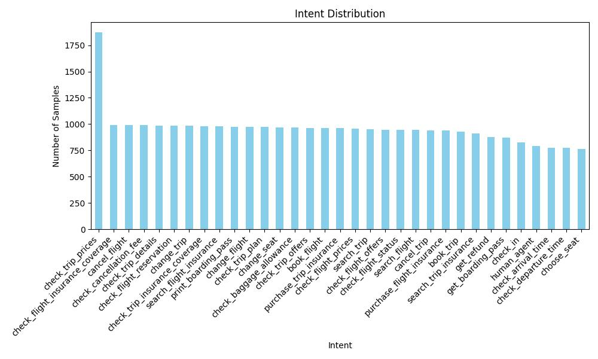

# Travel Guide ChatBot Implementation

The **Travel Guide ChatBot** is a domain-specific conversational agent built using a fine-tuned **T5-small Transformer model** from hugging face. It is designed to help users with real-time, accurate responses to travel-related questions such as visa requirements, flight bookings, baggage rules, local transport advice, and more.

With its interactive interface built using **Gradio**, users can ask open-ended questions and receive fluent, context-aware answers instantly.

---

## Project Overview

As global travel increases, there is a growing demand for automated assistants that can help users with detailed travel logistics at any hour. 
I fine-tuned a **T5-small** model using the [Bitext Travel LLM Chatbot Dataset](https://huggingface.co/datasets/bitext/Bitext-travel-llm-chatbot-training-dataset) and achieved strong semantic performance through structured training, evaluation, and deployment.
---
##
Acess the chatbot Interface here: https://huggingface.co/spaces/chrisostome/travel_guide_chatbot

Or the demo video here:

## Implementation Steps

### 1. Dataset Acquisition

- Used the **Bitext Travel LLM Chatbot Dataset** containing:
  - User instructions
  - Associated intents
  - Ideal travel support responses

This dataset was explored to understand further how it is structured including analyzing the intents in the dataset and other basic EDA steps.


---

### 2. Preprocessing & Data Preparation

- **Normalization**: Lowercased all text, stripped whitespace, and removed unwanted characters
- **Deduplication**: Removed duplicate entries to enhance generalization
- **Tokenization**: Used `T5Tokenizer`  for t5-small model to tokenize both inputs and outputs
- **Train/Validation Split**: 90% for training, 10% for validation using Hugging Face `train_test_split`

---

### 3. Model Fine-Tuning

- Base model: `T5-small` from Hugging Face Transformers
- Training managed via Hugging Face's `Trainer` API

#### Training Parameters:

| Parameter         | Value        |
|------------------|--------------|
| Epochs           | 3            |
| Batch Size       | 8 (train) / 16 (eval) |
| Initial LR       | 2e-5         |
| Finetune LR      | 5e-5         |
| Max Token Length | 128          |
| Eval Strategy    | Per Epoch    |

- After the initial training, a second fine-tuning phase was conducted using a higher learning rate (5e-5), which helped reduce the validation loss significantly.

---

### 4. Results & Evaluation

The model was evaluated using the following evaluation metrics.

| Metric       | Score    | Description                                    |
|--------------|----------|------------------------------------------------|
| **BLEU**     | 0.6543   | Captures phrasing and n-gram similarity        |
| **ROUGE-L**  | 0.7673   | Recall of key information                      |
| **F1 Score** | 0.7849   | Accuracy and relevance of response tokens      |
| **BERTScore**| 0.9704   | Semantic similarity to human-written answers   |
| **Perplexity**| 1.44     | Confidence and fluency of generated answers    |

#### Qualitative Examples:


These responses reflect fluency, relevance, and semantic understanding.

---

### 5. Deployment with Gradio

The chatbot is wrapped inside a simple **Gradio** web app, providing users with an easy-to-use text interface. as it can be seen in the ** querry examples above**

### 6. Key Findings

1.  A huge effect of finetuning the model: The loss dropping from 0.63 to 0.36 indicates that the model learned meaningful patterns from the training data during fine-tuning.

  A loss reduction meant that the model's output was getting closer to the target answers in the dataset.
  Using a moderately high learning rate (5e-5) helped the model converge quickly without instability.

2. BLEU Score,  ROUGE-L,  Perplexity, F1 Score, and BERTScore:

  A BLEU score of 0.65 illustrated that the model captured phrasing and structure close to human responses. This showed that answers are not random or overly generic replies.

  A ROUGE-L score of 0.77 also showed that generated answers include most of the key information from reference answers, therefore, preserving semantic completeness while answering.

  A Perplexity of 1.44 measured how confident the model was in its predictions, which is an indicator that it learned.

  An F1 Score: 0.7849 showed that the answers are accurately matching relevant portions of the reference outputs.

  And finally, a BERTScore of 0.97 illustrated that generated responses are semantically nearly identical to the references. The chatbot understands the meaning and context of the question deeply, even when rephrasing the answer differently.

Overall,  the model is semantically aligned with the ground truth (dataset references), and it's not just copying words, but understanding and generating coherent meaning.


### 7. How To Use Locally
To use t locally, follow the following steps:
1. 
```
git clone https://github.com/Chrisos10/travel_guide_chatbot.git
```
2. 
```
cd travel_guide_chatbot
```
3. 
```
pip install -r requirements.txt
```
4.
```
python app.py
```
Or Run the google collab notebook